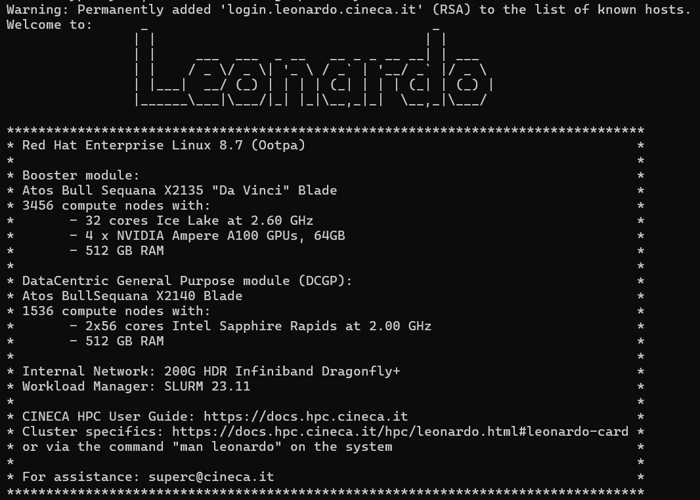

# Emergent Capabilities of LLMs: Evaluate Planning and Reasoning in Large Language Models Modulo Framework

## Authors

- **Alessandro Gentili** - *AI Student @UniBo* - [GitHub](https://github.com/alessandrogentili001)
- **Lorenzo D'Ascenzo** - *AI Student @UniBo* - [GitHub](https://github.com/Lorenzo00dash)

## Abstract

This project extends previous work by our colleagues [Merola, Sigh, and Dardouri](https://dvcs.apice.unibo.it/pika-lab/courses/ai-ethics/projects/merolasinghdardouri2425) on evaluating LLM performance in planning tasks under the supervision of an external validator. The proposed extensions focus on two directions: (1) exploring emergent reasoning capabilities across a broader range of open-source large language models, including Kimi, LLaMA, and Gemma, to assess whether planning abilities generalize across architectures; and (2) enriching the benchmark dataset with new, challenging planning problems of graded complexity. Together, these extensions aim to deepen our understanding of LLM reasoning, improve evaluation reliability, and foster reproducible benchmarks for the research community.

## Disclaimer

The correct execution of experiments in this project requires substantial computational resources. The majority of our experimental work will be conducted using the **Leonardo supercomputer cluster node** provided by [CINECA](https://www.cineca.it/), one of the most powerfull supercomputing centers. 
Access to Leonardo's computational capabilities enables us to perform experiments that would be infeasible on standard computing hardware, ensuring the reproducibility and scalability of our research findings.

## Documentation

### Repository Structure

```text
LLM-Needs-a-Plan/
├── README.md
├── config.yml
├── requirements.txt
├── requirements_analysis.txt
├── Results Analysis.ipynb
├── analysis_venv/
│   └── ... (virtual environment files)
├── assets/
|   ├── images/
│   │   └── ... (images and plots)
│   ├── literature/
│   │   └── ... (papers and references)
│   └── tutorials/
│       ├── 1. Pre Configuration.md
│       ├── 2. Cluster Set Up.md
│       ├── 3. Load Local Files Into The Cluster.md
│       ├── 4. First Job Submission.md
│       ├── 5. Work Directory And LLMs Download.md
│       └── 6. SLURM Files Explained.md
├── scripts/
│   ├── gemma3_iters_1.sh
│   ├── gemma3_iters_2.sh
│   ├── gemma3_iters_3.sh
│   ├── gemma3_iters_4.sh
│   ├── gemma3_iters_4_citycar.sh
│   ├── gemma3_iters_4_tetris.sh
│   ├── kimi_iters_1.sh
│   ├── kimi_iters_2.sh
│   ├── kimi_iters_3.sh
│   ├── kimi_iters_4.sh
│   ├── kimi_iters_4_citycar.sh
│   ├── kimi_iters_4_tetris.sh
│   ├── llama3_iters_1.sh
│   ├── llama3_iters_2.sh
│   ├── llama3_iters_3.sh
│   ├── llama3_iters_4.sh
│   ├── phi4_iters_1.sh
│   ├── phi4_iters_2.sh
│   ├── phi4_iters_3.sh
│   └── phi4_iters_4.sh
├── src/
│   ├── main.py
│   ├── core/
│   │   ├── __init__.py
│   │   ├── file_manager.py
│   │   ├── model_manager.py
│   │   ├── pddl_planner.py
│   │   ├── pddl_processor.py
│   │   └── README.md
│   ├── data/
│   │   ├── README.md
│   │   ├── citycar/
│   │   │   └── ... (PDDL domain & problems)
│   │   └── tetris/
│   │       └── ... (PDDL domain & problems)
│   ├── models/
│   │   ├── README.md
│   │   └── ... (paths to weights & tokenizers)
│   ├── prompts/
│   │   ├── __init__.py
│   │   └── prompts.py
│   ├── results/
│   │   ├── gemma3/
│   │   ├── kimi/
│   │   ├── llama3/
│   │   └── phi4/
│   ├── tests/
│   │   ├── test_cluster.py
│   │   ├── test_file_manager.py
│   │   ├── test_model_manager.py
│   │   ├── test_pddl_planner.py
│   │   ├── test_pddl_processor.py
│   │   └── test_val_integration.py
│   └── utils/
│       ├── __init__.py
│       ├── answer_postprocessor.py
│       ├── common_utils.py
│       ├── configuration.py
│       ├── logging_utils.py
│       └── validator.py
└── VAL/
    ├── CMakeLists.txt
    ├── doxygen.config
    ├── LICENSE
    ├── README.md
    └── ... (validator source, libraries, samples, scripts)
```

### Literature Review

A bunch of papers inspired this work. You can have a look on them [here](assets/literature/).

### Leonardo HPC

An official guide to the cluster login and setup is provided:

- [Leonardo Guide](assets/Guida%20Leonardo.pdf)

Additional step-by-step tutorials about the configuration, setup and usage of the Leonardo cluster are in the `assets/tutorials` folder:

- [Pre-Configuration Steps](assets/tutorials/1.%20Pre%20Configuration.md)  
- [Cluster Node Configuration](assets/tutorials/2.%20Cluster%20Set%20Up.md)  
- [First Job Submission](assets/tutorials/3.%20Load%20Local%20Files%20Into%20The%20Cluster.md)  
- [File Transfer Guide](assets/tutorials/4.%20First%20Job%20Submission.md) 
- [Work Directory And LLMs Download](assets/tutorials/5.%20Work%20Directory%20And%20LLMs%20Download.md)
- [SLURM files explained](assets/tutorials/5.%20SLURM%20DFiles%20Explained.md)



### Problems

The planning problems, written in PPDL language, are taken from this [repository](https://github.com/potassco/pddl-instances), where a description and multiple instances are provided for each problem. In particular we have selected a couple of them:

- [Tetris](https://github.com/potassco/pddl-instances/tree/master/ipc-2014/domains/tetris-sequential-satisficing)
- [City Car](https://github.com/potassco/pddl-instances/tree/master/ipc-2014/domains/city-car-sequential-satisficing)

Each of the selected problems comes with a list of instances at different scale and complexity. You can have an in depth look by reading [this](src/data/README.md).

### LLMs

This project utilizes three state-of-the-art large language models to evaluate and compare their planning and reasoning capabilities. The selection provides a comprehensive analysis across different model sizes and architectures, from compact efficiency to high-capacity reasoning:

- **[Llama 3.1 8B Instruct](https://huggingface.co/meta-llama/Llama-3.1-8B-Instruct)** - Meta's efficient 8B parameter model, optimized for instruction following with good balance of speed and performance.

- **[Phi-4](https://huggingface.co/microsoft/Phi-4)** - Microsoft's 14B parameter reasoning-optimized model, designed for complex problem-solving and planning tasks with superior reasoning capabilities.

- **[Gemma-3 27B IT](https://huggingface.co/google/gemma-3-27b-it)** - Google's high-capacity 27B parameter model with advanced instruction-tuning, providing state-of-the-art performance on reasoning benchmarks.

- **[Kimi-Dev-72B](https://huggingface.co/moonshotai/Kimi-Dev-72B)** - MoonshotAI's 72B parameter model with advanced problem solving capabilities, providing state-of-the-art performance on SWE probelms benchmark.

All models are freely available on Hugging Face (Llama 3.1 requires accepting Meta's license agreement). You can have an in depth view [here](src/models/README.md).

### Tests

Small scripts are added [here](src/tests) to test things on an ongoing basis.

### Validator

You can find the planning validator description [here](https://github.com/KCL-Planning/VAL?utm_source=chatgpt.com).

